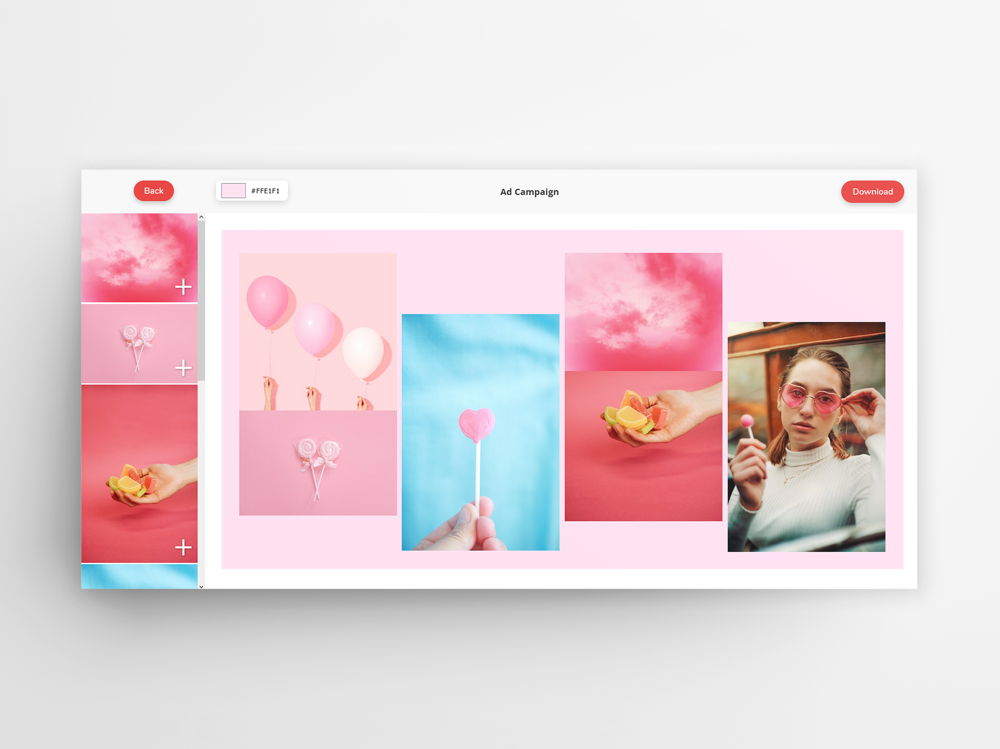

# Moodscape
[Moodscape](https://mood-scape.onrender.com/) is an app that allows users to easily create moodboards, or, in other words, collages that are used to convey a certain feeling or aesthetic. Users can search for images (powered by the Unsplash API), and can add their liked images to a canvas. Images on the canvas can be dragged around, deleted, and layered as needed. Additionally, the canvas background colour can be changed. The user can then download their creation to their own device.

## Contributors
* @ChrisPag - Christina Bose Paguirigan
* @carmenskoretz - Carmen Skoretz

## Technologies
* ReactJS
* Unsplash API

## Dependencies
* Masonry-Layout
* ImagesLoaded
* React-Color
* React-Modal
* Html2canvas
* React-Draggable
* React-Router-DOM

## Getting Started with Create React App
>
>This project was bootstrapped with [Create React App](https://github.com/facebook/create-react-app).
>
>## Available Scripts
>
>In the project directory, you can run:
>
>### `npm start`
>
>Runs the app in the development mode.\
>Open [http://localhost:3000](http://localhost:3000) to view it in your browser.
>
>The page will reload when you make changes.\
>You may also see any lint errors in the console.
